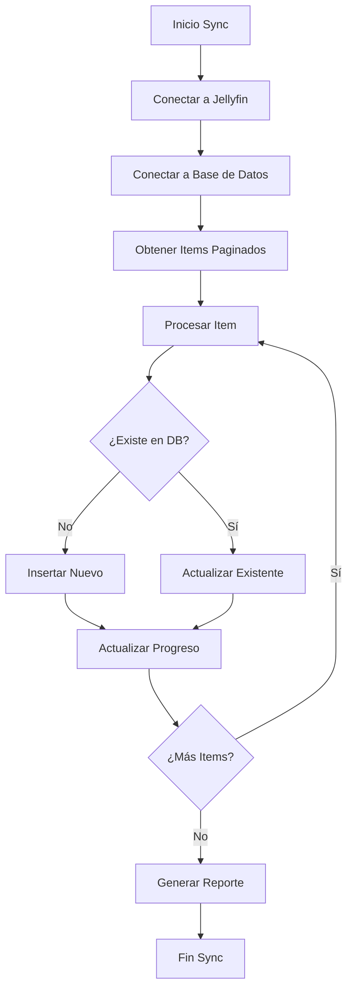

# 🎭 Parody Critics - Jellyfin Sync System

Sistema completo de sincronización con Jellyfin que incluye cliente asíncrono, interfaz visual de progreso y CLI para operaciones de sincronización.

## 🏗️ Arquitectura del Sistema

```
🎭 Parody Critics Sync System
├── 🔄 sync_cli.py              # CLI principal para operaciones
├── 📦 utils/
│   ├── jellyfin_client.py      # Cliente async Jellyfin con paginación
│   ├── sync_progress.py        # Sistema de progreso visual con Rich
│   ├── sync_manager.py         # Orquestador principal de sync
│   └── logger.py               # Sistema de logging integral
├── 🗄️ database/
│   ├── schema.sql              # Esquema de base de datos
│   └── critics.db              # Base de datos SQLite
└── ⚙️ .env                     # Configuración de ambiente
```

## 🚀 Características Principales

### 🔗 Cliente Jellyfin Asíncrono
- **Paginación automática** para bibliotecas grandes
- **Conexión persistente** con pool de conexiones
- **Reintentos inteligentes** con backoff exponencial
- **Caché de respuestas** para optimizar rendimiento
- **Manejo robusto de errores** con logging detallado

### 📊 Sistema de Progreso Visual
- **Barras de progreso** en tiempo real con Rich
- **Estadísticas detalladas** (nuevos, actualizados, errores)
- **Estimación de tiempo** de finalización (ETA)
- **Métricas de rendimiento** (items/segundo)
- **Reporte final** con resumen completo

### 🎛️ CLI Completo
- **sync**: Sincronizar biblioteca de Jellyfin
- **status**: Ver estadísticas de la base de datos
- **history**: Historial de sincronizaciones
- **cleanup**: Limpiar elementos huérfanos
- **test**: Probar conectividad del sistema

### 🔧 Sistema de Logging
- **Niveles configurables** (DEBUG, INFO, WARNING, ERROR)
- **Rotación automática** de archivos de log
- **Salida colorizada** en terminal
- **Logging por componente** para facilitar debugging
- **Registro de excepciones** con stack traces

## 📖 Guía de Uso

### Configuración Inicial

1. **Ejecutar el wizard de configuración:**
```bash
python simple_wizard.py --demo
```

2. **Verificar que todo esté configurado:**
```bash
python sync_cli.py test
```

### Operaciones de Sincronización

#### Sincronización Completa
```bash
# Sync básico con todas las películas y series
python sync_cli.py sync

# Sync con tamaño de página personalizado
python sync_cli.py sync --page-size 50

# Dry run para ver qué se sincronizaría
python sync_cli.py sync --dry-run
```

#### Monitoreo y Estadísticas
```bash
# Ver estado actual del sistema
python sync_cli.py status

# Ver historial de sincronizaciones
python sync_cli.py history --limit 20

# Limpiar elementos huérfanos
python sync_cli.py cleanup
```

#### Logging con Debug
```bash
# Habilitar logging detallado
python sync_cli.py --debug sync

# Ver información del sistema de logging
python simple_wizard.py --log-info
```

## 🛠️ Componentes Técnicos

### JellyfinClient (`utils/jellyfin_client.py`)

Cliente asíncrono para API de Jellyfin con características avanzadas:

```python
from utils import JellyfinClient

async with JellyfinClient(
    base_url="http://jellyfin:8096",
    api_key="tu-api-key",
    timeout=30,
    enable_cache=True
) as client:

    async for item, page, total_pages in client.get_movies_and_series():
        print(f"Procesando: {item['Name']}")
```

**Características:**
- ✅ Paginación automática
- ✅ Caché inteligente
- ✅ Reintentos con backoff exponencial
- ✅ Context manager para gestión de recursos
- ✅ Progress callbacks

### SyncProgressDisplay (`utils/sync_progress.py`)

Sistema de visualización de progreso con Rich:

```python
from utils import SyncProgressDisplay

progress_display = SyncProgressDisplay()

with progress_display.sync_session("Mi Sync Operation"):
    progress_display.set_total_items(1000)

    for i in range(1000):
        progress_display.record_new_item(f"Item {i}")
        # Trabajo aquí...
```

**Características:**
- 🎨 Interfaz visual atractiva
- 📊 Métricas en tiempo real
- ⏱️ Estimaciones de tiempo
- 📝 Tracking de errores
- 🎯 Estadísticas detalladas

### SyncManager (`utils/sync_manager.py`)

Orquestador principal que coordina todas las operaciones:

```python
from utils import SyncManager

async with SyncManager(
    jellyfin_url="http://jellyfin:8096",
    api_key="api-key",
    database_path="database/critics.db"
) as sync_manager:

    results = await sync_manager.sync_jellyfin_library(
        page_size=100
    )

    print(f"Sincronizados: {results['items_processed']}")
```

**Características:**
- 🔄 Orchestración completa del sync
- 🗄️ Operaciones de base de datos
- 📋 Historial de sincronizaciones
- 🧹 Limpieza de datos huérfanos
- 📊 Reportes detallados

## 📁 Estructura de la Base de Datos

### Tabla: `media`
```sql
CREATE TABLE media (
    id INTEGER PRIMARY KEY AUTOINCREMENT,
    jellyfin_id TEXT UNIQUE,
    tmdb_id TEXT,
    imdb_id TEXT,
    title TEXT NOT NULL,
    original_title TEXT,
    year INTEGER,
    type TEXT CHECK(type IN ('movie', 'series')),
    genres TEXT,  -- JSON array
    overview TEXT,
    runtime INTEGER,
    vote_average REAL,
    created_at TIMESTAMP DEFAULT CURRENT_TIMESTAMP,
    updated_at TIMESTAMP DEFAULT CURRENT_TIMESTAMP
);
```

### Tabla: `sync_log`
```sql
CREATE TABLE sync_log (
    id INTEGER PRIMARY KEY AUTOINCREMENT,
    session_id TEXT UNIQUE NOT NULL,
    operation TEXT NOT NULL,
    status TEXT CHECK(status IN ('started', 'completed', 'failed', 'completed_with_errors')),
    started_at TIMESTAMP DEFAULT CURRENT_TIMESTAMP,
    completed_at TIMESTAMP,
    items_processed INTEGER DEFAULT 0,
    items_added INTEGER DEFAULT 0,
    items_updated INTEGER DEFAULT 0,
    error_message TEXT
);
```

## ⚙️ Configuración (.env)

```env
# Jellyfin Configuration
JELLYFIN_URL=http://192.168.45.181:8097
JELLYFIN_API_TOKEN=demo-api-token

# Database
PARODY_CRITICS_DB_PATH=database/critics.db

# Sync Configuration
SYNC_BATCH_SIZE=100
SYNC_MAX_CONCURRENT=5

# Logging
PARODY_CRITICS_LOG_LEVEL=INFO
```

## 🐛 Troubleshooting

### Errores Comunes

**Error de conexión a Jellyfin:**
```bash
# Verificar conectividad
python sync_cli.py test

# Verificar configuración
python simple_wizard.py --log-info
```

**Base de datos bloqueada:**
```bash
# Verificar que no haya otros procesos usando la DB
lsof database/critics.db

# Usar modo WAL (habilitado por defecto)
```

**Memoria insuficiente en sync grandes:**
```bash
# Reducir tamaño de página
python sync_cli.py sync --page-size 25

# Habilitar debug para monitorear
python sync_cli.py --debug sync
```

### Logging y Debug

Los logs se almacenan en:
- `logs/parody_critics.log` - Log general
- `logs/parody_critics_errors.log` - Solo errores

**Niveles de log disponibles:**
- `DEBUG`: Información detallada para debugging
- `INFO`: Operaciones principales
- `WARNING`: Situaciones que requieren atención
- `ERROR`: Errores que requieren intervención

## 🎯 Flujo de Sincronización



## 🚀 Próximas Mejoras

- [ ] **Sync incremental** basado en timestamps
- [ ] **Paralelización** de requests para mayor velocidad
- [ ] **Webhooks** para sync en tiempo real
- [ ] **API REST** para operaciones remotas
- [ ] **Dashboard web** para monitoreo visual
- [ ] **Notificaciones** (email, Slack, etc.)
- [ ] **Backup/restore** automático de base de datos
- [ ] **Métricas avanzadas** con Prometheus

---

**🎭 El sistema de sincronización está listo para generar críticas hilarantes con datos actualizados de Jellyfin!**

> *"El spice debe fluir... ¡y también los datos!"* - SAL-9000 🤖